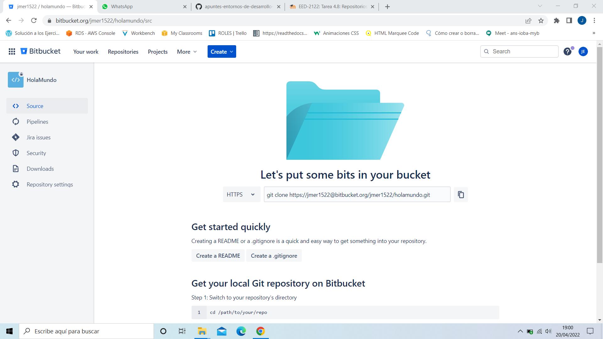
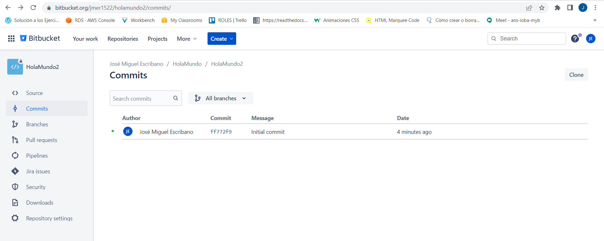
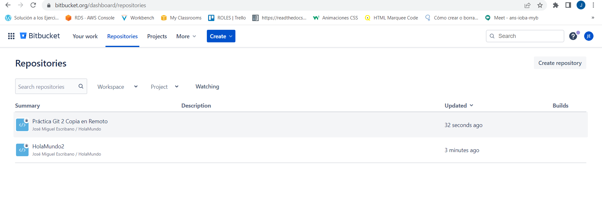
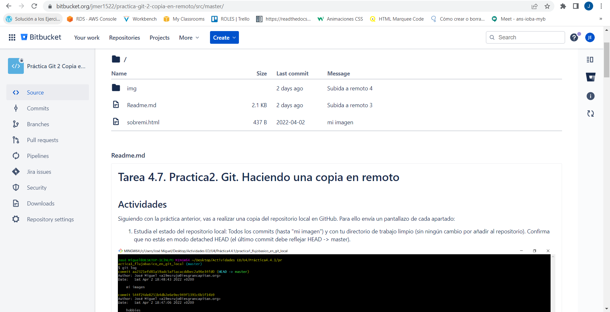
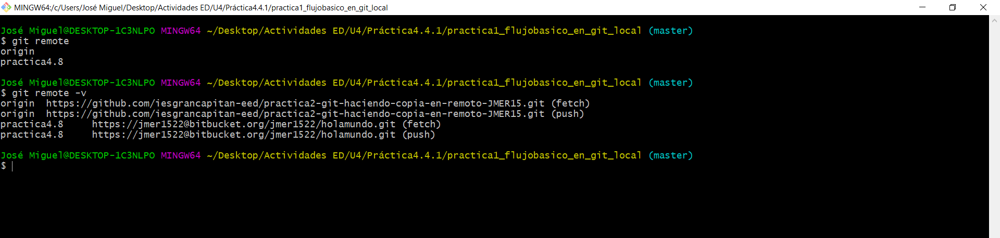
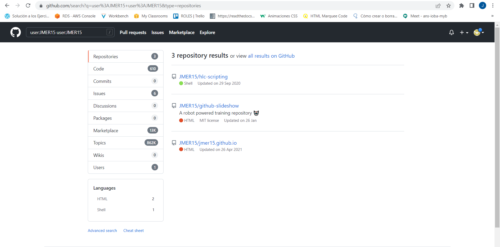
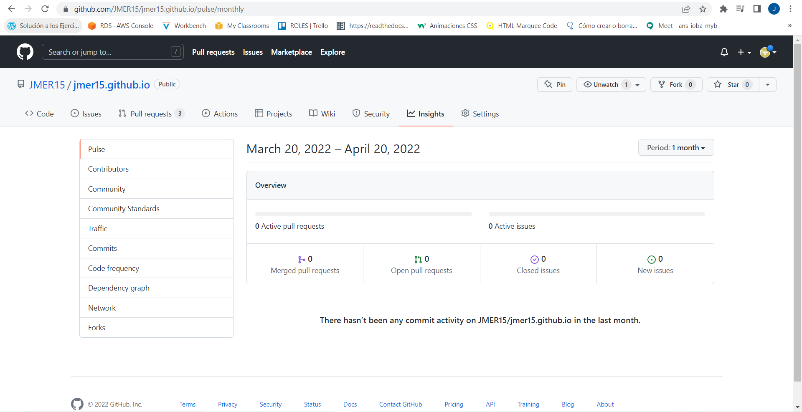
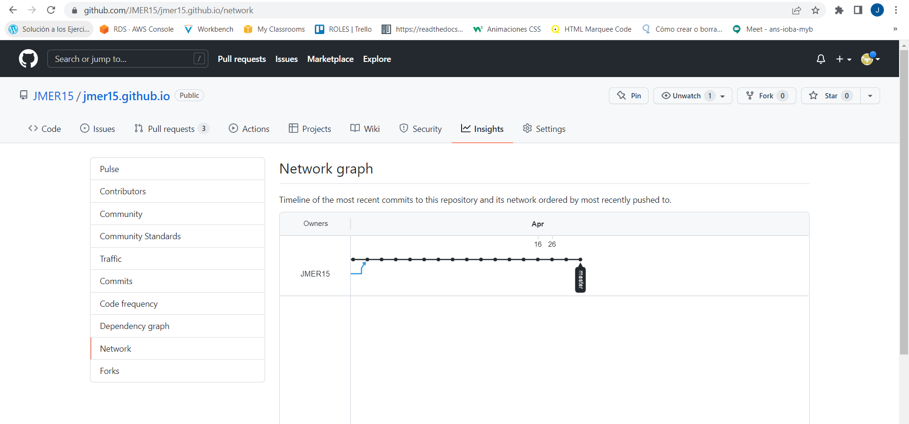

# Tarea 4.8: Repositorios remotos y servidores.
## Actividades

Contesta:

**1. Qué es un repositorio remoto, permisos y su importancia en la colaboración de proyectos.**

Los repositorios remotos son versiones de tu proyecto que están hospedadas en Internet o en cualquier otra red. Puedes tener varios de ellos, y en cada uno tendrás generalmente permisos de solo lectura o de lectura y escritura.

**2. origin. Qué es**

Origin es el nombre abreviado por defecto de repositorios remotos.

**3. Servidor Bitbucket. Date de alta en Bitbucket y crea un repositorio Hola Mundo. Manda un pantallazo con el  historial de commits realizados (identificador SHA-1).**

**4. Sube a tu servidor Bitbucket un segundo repositorio: el de la última práctica Practica2. Git. Haciendo una copia en remoto. PARA ESO AÑADE UN SEGUNDO REMOTE. Muestra un pantallazo tanto del repositorio en BitBucket como de "git remote" en el repositorio local.**

**BitBucket**

**Git Bash**

5. En el servidor GitHub:

    1. Realiza una búsqueda de todos tus repositorios (user:USERNAME)
   
    

    2. Busca un repositorio tuyo con muchos commits y muestra un par de pantallazos del apartado "Insights", incluyendo el apartado Network.

    

    

**Lourdes dado que el máximo periodo que puedes mostrar es 1 mes y mis repositorios el último commit tiene mas de 1 año no puedo mostrarte lo que se vería en pulse y network pero esta referenciado como se haría.**

De interés: 

- [Fundamentos-de-Git-Trabajar-con-Remotos](https://git-scm.com/book/es/v2/Fundamentos-de-Git-Trabajar-con-Remotos)

- [bitbucket-vs-github](https://bitbucket.org/product/es/comparison/bitbucket-vs-github)

- [searching-for-repositories](https://docs.github.com/en/search-github/searching-on-github/searching-for-repositories)

- [viewing-a-repositorys-network](https://docs.github.com/es/repositories/viewing-activity-and-data-for-your-repository/understanding-connections-between-repositories)

